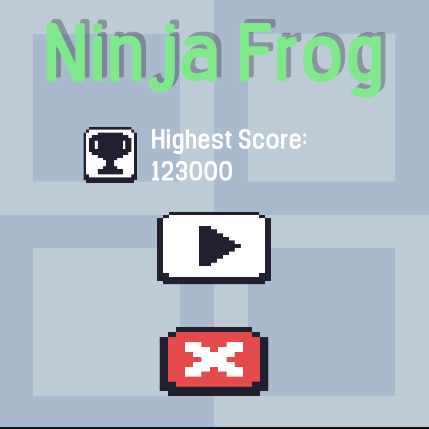
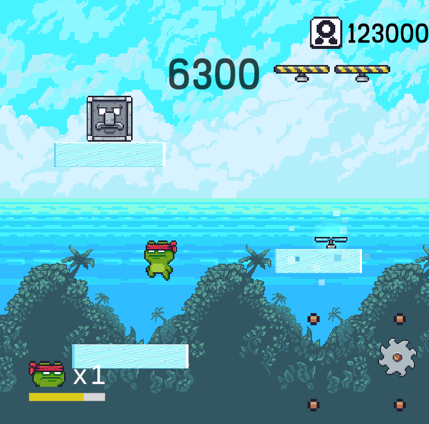
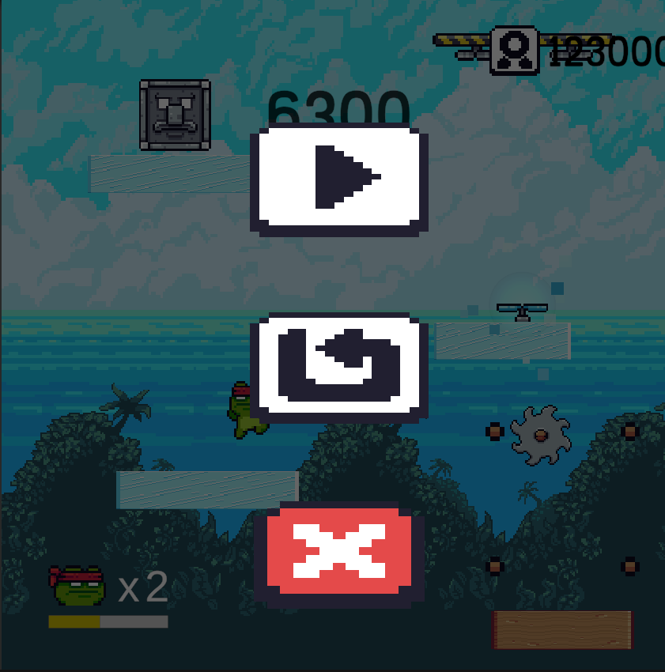
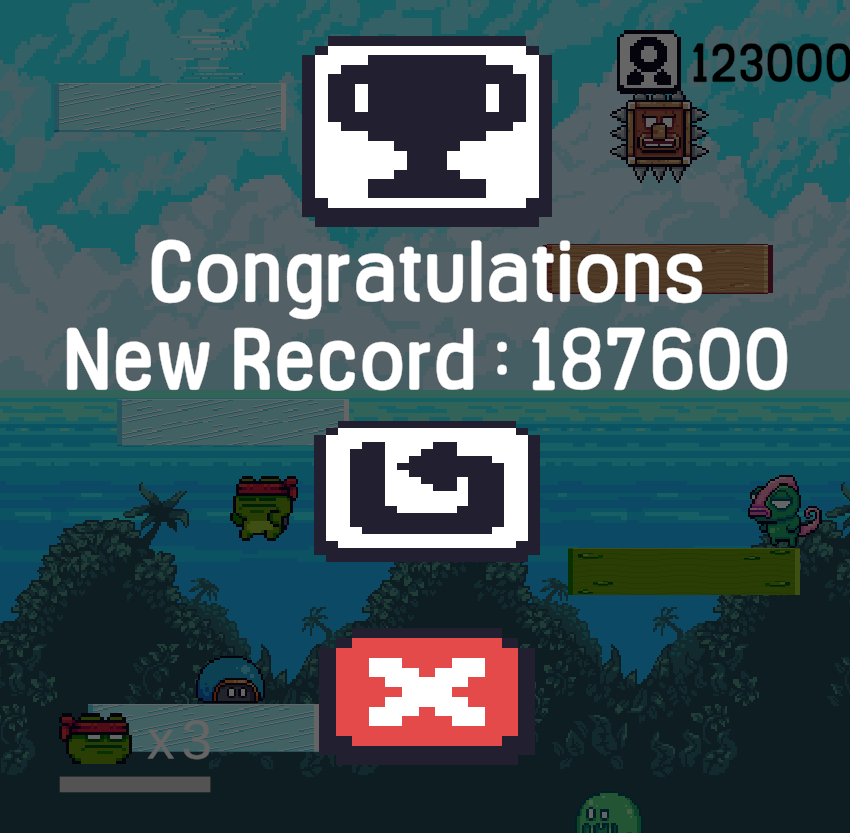
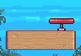
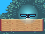
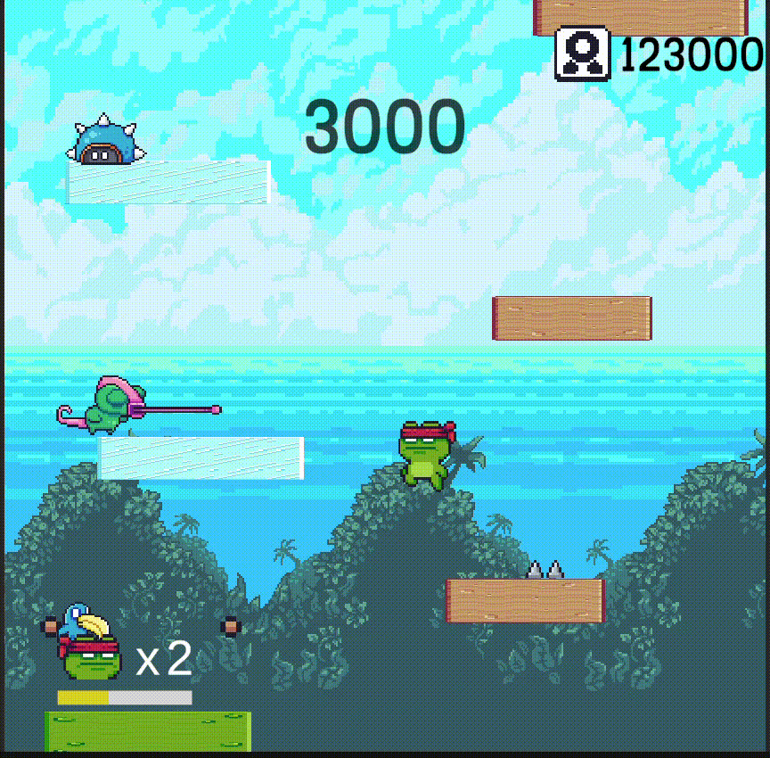
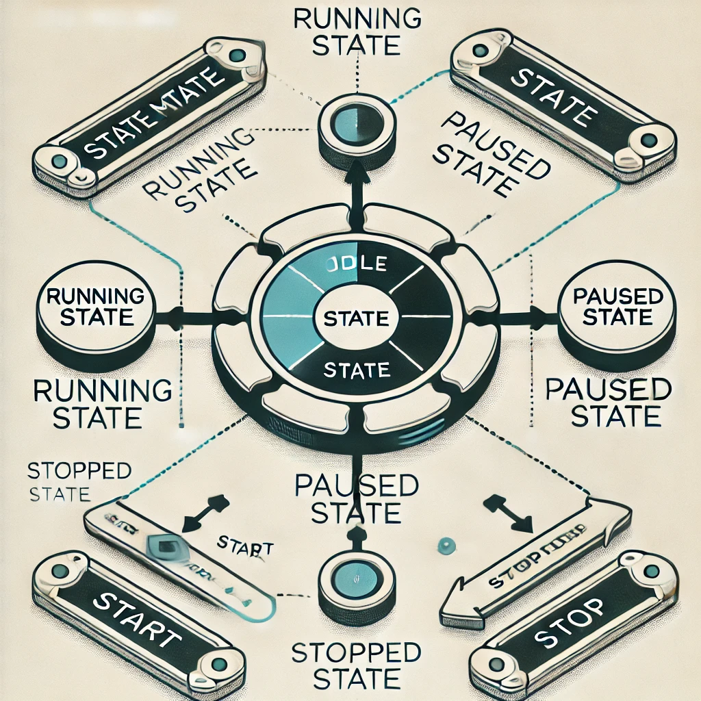
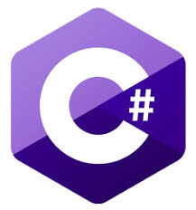

# Ninja Frog

**Ninja Frog**는 **Doodle Jump**를 모티브로 만든 게임입니다.

# Contributor
- H00ong(박재홍)

# Asset Attribution
**Assets/Free** 폴더와 **Assets/Enemies** 폴더에 있는 에셋은 아래 사이트에서 제공하는 무료 리소스를 사용한 것입니다.  
이 에셋은 Pixel Frog 페이지에 명시된 조건에 따라 무료로 사용 가능합니다.

- 출처: [Pixel Adventure 1 by Pixel Frog](https://pixelfrog-assets.itch.io/pixel-adventure-1)  
  - 폴더: `Assets/Free`
- 출처: [Pixel Adventure 2 by Pixel Frog](https://pixelfrog-assets.itch.io/pixel-adventure-2)  
  - 폴더: `Assets/Enemies`

# 목차
0. [시작하기](#게임-시작하기)
1. [게임 조작 방법](#게임-조작-방법)
2. [게임 구성](#게임-구성)
3. [아이템 및 기능](#아이템-및-기능)
   - [Trampline](#Trampline)
   - [Helicopter](#Helicopter)
   - [Flash](#Flash)
4. [코드 설명](#코드-설명)
   - [StateMachine](#StateMachine)
   - [Player](#Player)
   - [Enemy](#Enemy)
      - BlueBird, Bat, Plant
      - Slime, Turtle, Tree, Bunny, Chameleon
5. [기술 스택](#기술-스택)
      
## 시작하기
1. **GitHub에서 다운로드**
   - GitHub 페이지로 이동한 후, `Code` 버튼을 클릭하고 **Download ZIP**을 선택하거나 아래 명령어로 레포지토리를 클론합니다:
     ```bash
     git clone https://github.com/H00ong/NinjaFrog.git
     ```

2. **Unity Hub에서 프로젝트 열기**
   - Unity Hub를 실행합니다.
   - **Add Project** 버튼을 눌러 다운로드받은 프로젝트 폴더를 선택합니다.

4. **Unity 버전 확인**
   - Unity 프로젝트에 사용된 **Unity 버전**은 **2022.3.37f1(LTS)** 입니다.
   - 동일한 버전을 설치하지 않으면 충돌이 발생할 수 있으므로, Unity Hub에서 올바른 버전을 설치하세요.

6. **필요한 패키지 복원**
   - Unity가 프로젝트를 열 때 자동으로 필요한 패키지를 복원합니다.
   - 복원이 완료된 뒤 프로젝트가 정상적으로 열리는지 확인합니다.

7. **게임 플레이하기**
   - 업로드 된 Build_Part1과 Build_Part2 Zip파일을 하나의 폴더 아래에 압축 해제합니다.
   - NinjaFrog.exe 파일을 실행하면 됩니다.

## 게임 조작 방법
- **왼쪽 이동**: `A` 키 또는 `←` 키
- **오른쪽 이동**: `D` 키 또는 `→` 키
- **미러링 기능**: 화면의 왼쪽 끝으로 이동하면 오른쪽 끝으로 이동하며, 그 반대도 가능합니다.
- **순간 이동**: `Space`키를 누르면 Player위의 2번째 Ground위로 순간 이동합니다.
- **ESC**: 'Escape'키를 누르면 Play를 중단할 수 있습니다. 

## 게임 구성



- 처음 시작 화면입니다. 최고 점수를 보여주고 플레이 버튼과 Quit 버튼이 주어집니다.



- In game 화면입니다. 우측 상단에 최고 점수를 보여주고 좌측 하단에는 Flash 남은 횟수와 gauge를 보여줍니다.



- ESC 화면. Escape를 누른 경우에 나오는 화면입니다. 게임이 일시 중단됩니다. Escape 버튼을 다시 누르거나 play버튼을 누르면 재개합니다.
- Restart 버튼을 누르면 게임을 restart할 수 있습니다.



- Game Over 화면입니다. 최고 기록을 세웠을 때의 화면이고, 최고 기록을 세우지 못한 경우 위의 Icon은 나오지 않고 점수만 나옵니다.

## 아이템 및 기능
### Trampline

- 트램펄린을 타면 **더블 점프**를 할 수 있습니다.
- 더블 점프 중에는 적으로부터 피해를 받지 않습니다.


### Helicopter

- 헬리콥터 아이템에 닿으면 **비행**이 가능합니다.
- 플레이어 아래의 **파란색 게이지**는 아이템의 유지 시간을 표시합니다.
- 비행 중에는 적에게서 피해를 받지 않습니다.


### Flash
- `Space` 키를 누르면 **플래시**를 사용할 수 있습니다.
- 플레이어보다 높은 위치에 있는 **두 개의 위에 있는 그라운드**로 순간이동합니다.
- 플래시는 **충전 방식**이며, 아래 게이지를 통해 충전 시간을 확인할 수 있습니다.



## 코드 설명
### StateMachine


  - 이 게임은 위의 그림과 같은 **상태 머신(State Machine)** 기반으로 설계되었습니다.
  - State Machine은 Object의 상태를 저장하고 변이하도록 하는 객체입니다.
  - State Machine을 이용하면 State 간의 Transition을 안정적으로 수행할 수 있는 장점이 있습니다.
  - 특히 Unity안에서 animation을 transition 하는데 장점이 있습니다.
  - 해당 프로젝트에서는 **Player** 와 **Enemy**에 StateMachine을 사용하였습니다.

- StateMachine에는 아래와 같은 함수가 있습니다.
```csharp
public void InitializeState(PlayerState _startState)
{
    CurrentState = _startState;
    CurrentState.Enter();
}

public void ChangeState(PlayerState _newState)
{
    CurrentState.Exit();
    CurrentState = _newState;
    CurrentState.Enter();
}
```
- StateMachine은 상태를 초기화하거나 현재의 상태에서 다른 상태로의 전이를 담당합니다.
- State에는
```csharp
public void Enter();
public void Update();
public void Exit();
```
- 위의 3가지 함수가 기본적으로 정의되어 있습니다.
- 상태가 전이되면서 이전의 State의 Exit()가 호출됩니다.
- 새로운 상태의 Enter()가 호출됩니다.
- Update는 Unity안에서 따로 정의되어 있는 함수인 **Update()** 메서드 안에서 CurrentState.Update()에 의해 호출되어 동작을 수행합니다.

### Player
```csharp
public bool LayerCheck(LayerMask _layer)
{
    if (!Collider.enabled)
        return false;

    if (_layer == groundLayer)
    {
        RaycastHit2D hit = Physics2D.CircleCast(groundedCheck.transform.position, groundedRadius, Vector2.down, 0, _layer);

        if (hit.collider != null)
        {
            FallingGround fallingGround = hit.collider.GetComponent<FallingGround>();
            if (fallingGround != null)
            {
                fallingGround.Fall();
            }
            return true; // 충돌이 있는 경우 true 반환
        }
        return false; // 충돌이 없는 경우 false 반환
    }
    else
    {
        return Physics2D.CircleCast(groundedCheck.transform.position, groundedRadius, Vector2.down, 0, _layer);
    }
}
```
  1. Collider 활성화 여부 확인
    - Collider.enabled가 false일 경우 바로 false를 반환합니다.

  2. Ground 레이어 확인 (groundLayer)
    - CircleCast를 통해 충돌 여부를 확인합니다.
    충돌한 오브젝트에 FallingGround 컴포넌트가 있다면 Fall() 메서드를 호출합니다.
    충돌이 있다면 true, 없다면 false를 반환합니다.
    기타 레이어인 경우 단순히 CircleCast를 통해 충돌 여부를 확인하고 결과를 반환합니다.
    Enemy의 경우 Trigger 영역 안에 Player가 닿고 LayerCheck가 True가 반환되면 Enemy는 DeadState로 전환됩니다.

### Enemy
#### Enemy Types
- **Blue Bird**, **Bat**, **Plants**
  - !사진
  - 이들은 플레이어를 인지해야 합니다.
  - `PlayerDetector` 객체를 통해 일정 범위 내에 플레이어가 있는지 감지합니다.
  - 감지하는 로직은 Collider2D를 두고 Trigger로 설정하여, Trigger 영역 안에 들어오면 Player를 인식하게 됩니다.
  - 위의 사진에서 초록색 영역이 Trigger 영역입니다.
  - 플레이어를 인식하면 공격하거나 공격 방향을 결정합니다.
- **Chameleon**
  - 카멜레온은 혀로 공격하며, 애니메이션 프레임에 따라 혀의 길이가 달라집니다. 그에 따라 공격 범위 역시 달라집니다.
  - 유니티에서는 애니메이션 특정 프레임에 이벤트를 발생시킬 수 있습니다.
  - 이벤트로 함수를 설정하였고, Parameter로 혀의 길이 x scale값을 전달합니다.
  - 이를 통해 자식 객체의 길이가 설정하여 공격 길이를 조절하였습니다.

## 기술 스택
1.  2. 
- **C#**, **Unity**


